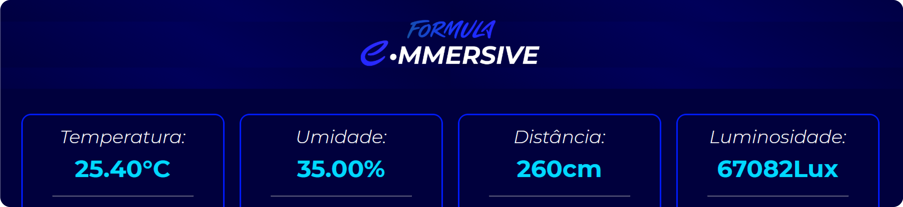
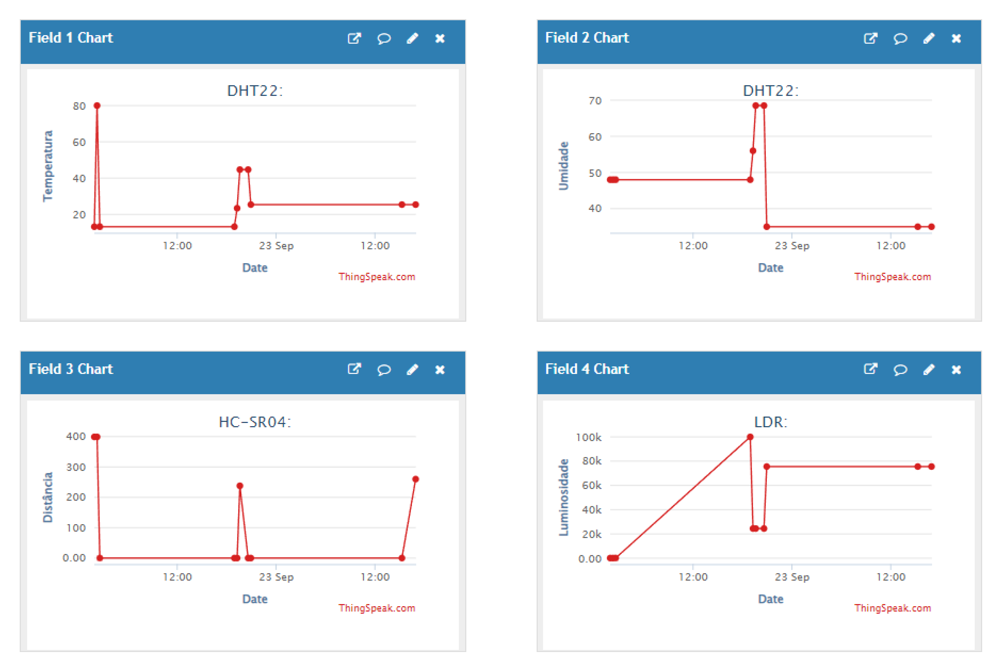
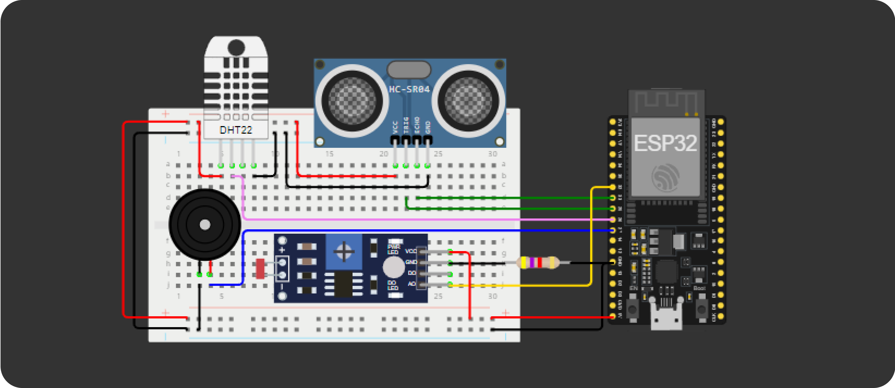

# INTEGRANTES
- **Guilherme Santos Nunes**
- **Kaique Zaffarani**
- **Kairo da Silva Silvestre de Carvalho**
- **Rafael Menezes Viana**

## LINKS
- **[VÍDEO EXPLICATIVO](https://youtu.be/QZd2da9OijI)**
- **[SITE](https://z4ffarani-educational.github.io/SEM2-CHALLENGE-EDGE-COMPUTING-AND-COMPUTER-SYSTEMS/)**
- **[CANAL IOT](https://thingspeak.com/channels/2665201)**
- **[SIMULADOR](https://wokwi.com/projects/409672865580237825)**

<br>

# PROJETO
A **[Tech Mahindra](https://www.techmahindra.com)**, em parceria com a **[FIAP](https://www.fiap.com.br)**, tem como objetivo popularizar a Fórmula E por meio de soluções tecnológicas interativas e práticas. Para alcançar essa meta, desenvolvemos um sistema IoT que exibe informações em tempo real utilizando a plataforma **[ThingSpeak](https://thingspeak.com)**, da **[MATLAB](https://www.mathworks.com/products/matlab.html)**, que armazena dados em nuvem. Esses dados são coletados por sensores conectados a um simulador de Arduino na plataforma **[Wokwi](https://wokwi.com)**, e também são disponibilizados em um site próprio através de uma API (Application Programming Interface).

O sistema é estruturado em três pilares:

- **Site** | Sincroniza e exibe dados no Front-end por meio de requisições HTTP e chave de API do Canal IoT, além de utilizar algoritmos personalizados para interpretar e apresentar os valores dos dados de forma intuitiva.

- **Canal IoT** | Processa os dados enviados pelo Simulador, apresentando-os em gráficos que facilitam a compreensão e o registro cronológico das informações.

- **Simulador** | Integra sensores conectados a um microcontrolador ESP32, que captam informações ambientais e as transmitem via Wi-Fi para o Canal IoT.

<br>

# INSTRUÇÕES
1. Em um terminal, clonar o repositório:
```bash
git clone https://github.com/Z4FFARANI-EDUCATIONAL/SEM2-CHALLENGE-EDGE-COMPUTING-AND-COMPUTER-SYSTEMS.git
```

2. No terminal, navegar até a pasta do projeto:
```bash
cd SEM2-CHALLENGE-EDGE-COMPUTING-AND-COMPUTER-SYSTEMS
```

3. Acessar o site navegando por: ``src/site/index.html`` e executar o arquivo: ``index.html``

4. Para rodar o Simulador, seguir o link disponibilizado e clicar no botão de iniciar. Levará algum tempo até que o simulador se conecte à rede pública do Wokwi e ao Canal IoT. É possível regular os níveis de condição relacionados aos sensores clicando neles, para que assim sejam registrados ao Canal IoT após um intervalo de 15 segundos. Para utilização física, é necessário executar o código presente no arquivo ``simulador.ino`` na pasta ``docs``, assim como instalar as bibliotecas dos sensores presentes na pasta ``libraries``. O programa Arduino IDE é adequado para o teste.

<br>

# FUNÇÕES

`src/simulador.ino`:
- **Inclusão de bibliotecas** | Importa as bibliotecas necessárias para a operação do ESP32 e para a comunicação com os sensores, permitindo o uso de funções específicas para cada tipo de sensor conectado.
  
- **Definição de portas de entrada** | Estabelece as portas digitais e analógicas do ESP32 que serão usadas para conectar e ler os dados dos sensores, garantindo a correta configuração do hardware.

- **Referenciamento e leitura dos sensores** | Configura e lê os dados dos sensores DHT22, HC-SR04 e LDR, processando as informações de temperatura, umidade, distância e luminosidade para envio posterior.

- **Constante para conexão WiFi, chave de API e servidor** | Define as credenciais necessárias para a conexão à rede Wi-Fi, a chave de API do ThingSpeak e o endereço do servidor, facilitando a comunicação entre o ESP32 e a plataforma de nuvem.

- **Envio de dados dos sensores para Canal IoT** | Implementa a lógica para enviar periodicamente os dados lidos dos sensores para o Canal IoT, utilizando a chave de API para autenticação e formatação adequada das requisições HTTP.

<br>

`src/site/script.js`:
- **Fetch de API** | Realiza uma requisição à API do Canal IoT para obter os dados armazenados, utilizando o método fetch do JavaScript para acessar recursos externos de forma assíncrona.

- **Conversão para JSON** | Processa a resposta da requisição, convertendo os dados recebidos em formato JSON, o que facilita a manipulação e exibição das informações no front-end.

- **Mapeamento de valores** | Itera sobre os dados JSON recebidos, extraindo os valores relevantes para exibição, permitindo a apresentação organizada e compreensível das informações ao usuário.

- **inner.HTML** | Atualiza o conteúdo HTML da página com os dados processados, utilizando a propriedade innerHTML para inserir dinamicamente as informações nos elementos apropriados da interface do usuário.

- **Resposta condicional** | Implementa lógica condicional para tratar diferentes estados dos dados recebidos, como erros na requisição ou dados ausentes, garantindo que a interface reaja de forma adequada a diferentes cenários.

<br>

# DIAGRAMA


<br>

# MONTAGEM DO SIMULADOR
- **1x** Cabo USB A - **R$15,00**
- **1x** ESP32-DevKitC V4 [**(Documentação)**](https://docs.espressif.com/projects/arduino-esp32/en/latest/) - **R$50,00**
- **1x** Sensor de distância ultrassônico HC-SR04 [**(Documentação)**](https://web.eece.maine.edu/zhu/book/lab/HC-SR04%20User%20Manual.pdf) - **R$13,00**
- **1x** Módulo de sensor de luminosidade (LDR) [**(Documentação)**](https://docs.google.com/document/d/1FECtFOYhgblp-J9JyAeC6D070fHu0u49S3C2awSFd5c/edit) - **R$10,00**
- **1x** Sensor de umidade e temperatura (DHT22) [**(Documentação)**](https://www.mouser.com/datasheet/2/737/dht-932870.pdf?srsltid=AfmBOorSkF-0gQ-mg5eU7CV1wMu6Tfkj42UYvsNNHSDjhMDF8vXLC82A) - **R$40,00**
- **1x** Piezoeletric buzzer ativo de 5V [**(Documentação)**](https://wiki-content.arduino.cc/documents/datasheets/PIEZO-PKM22EPPH4001-BO.pdf) - **R$4,00**
- **1x** Resistor de 4.7k Ω (ohms) - **R$2,00**
- **1x** Placa de ensaio (de preferência com 830 pontos) - **R$20,00**
- **12x** Cabos Jumper macho-macho (contados com a placa de ensaio incluída) - **R$3,00**
- **4x** Cabos Jumper macho-fêmea (contados com a placa de ensaio incluída) - **R$1,00**
- **1x** Cabo Jumper fêmea-fêmea (contado com a placa de ensaio incluída) - **R$0,25**
- **TOTAL - R$158,25**

<br>

# OBSERVAÇÕES
- A estabilidade da conexão Wi-Fi é fundamental para o funcionamento do sistema. Verifique se o módulo ESP32 está dentro do alcance da rede sem fio para garantir a transmissão de dados confiável.

- Os preços dos componentes do simulador estão sujeitos a valorização ou desvalorização.

- Este projeto utiliza o ThingSpeak, que possui limites de taxa para requisições de dados. Certifique-se de não exceder esses limites para evitar interrupções no serviço. Consulte a documentação do ThingSpeak para mais detalhes sobre as restrições.

- Caso sejam criadas para uso pessoal, as credenciais de Wi-Fi e a chave da API não devem ser expostas publicamente.

- O sistema está projetado para monitorar um número limitado de sensores. Para escalabilidade, considere utilizar uma arquitetura de microserviços ou de um sistema de mensageria para lidar com múltiplos dispositivos simultaneamente.
  
<br>

# TECNOLOGIAS
[](https://www.arduino.cc/en/software)
**[](https://developer.mozilla.org/pt-BR/docs/Web/HTML)**
**[](https://developer.mozilla.org/pt-BR/docs/Web/CSS)**
**[](https://developer.mozilla.org/pt-BR/docs/Web/JavaScript)**

<br>

# REFERÊNCIAS
- **[Instalação de bibliotecas no Arduino IDE](https://docs.arduino.cc/software/ide-v1/tutorials/installing-libraries/)**
